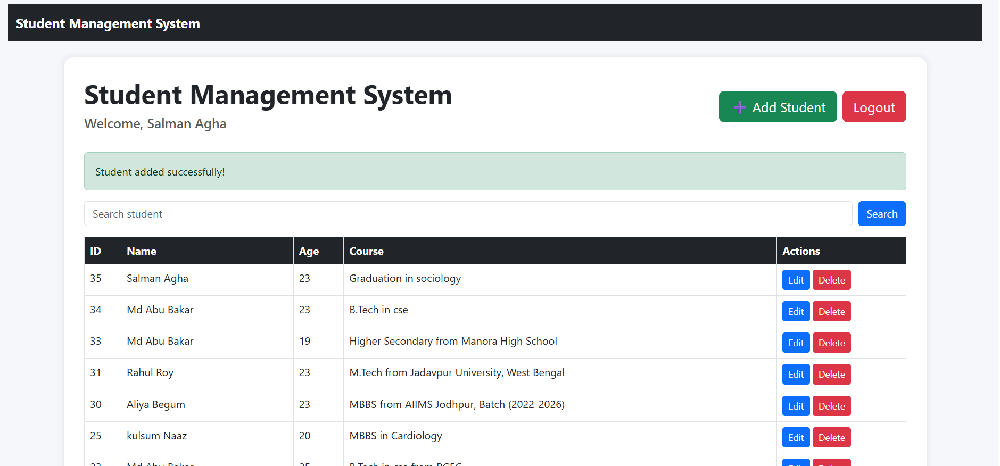
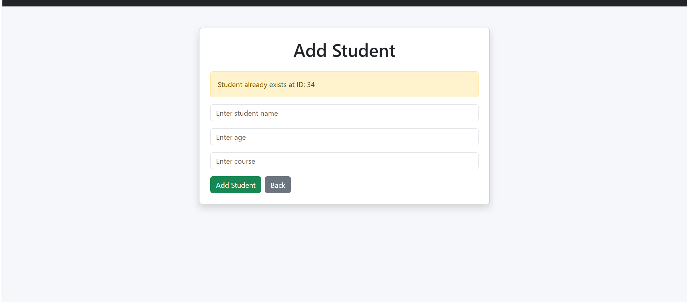
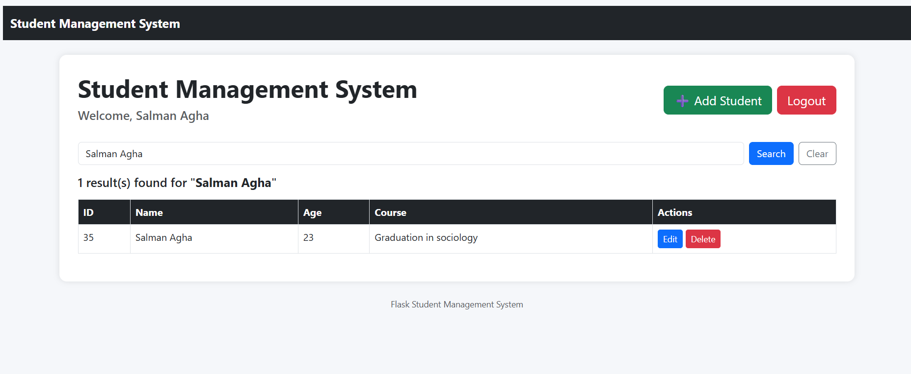
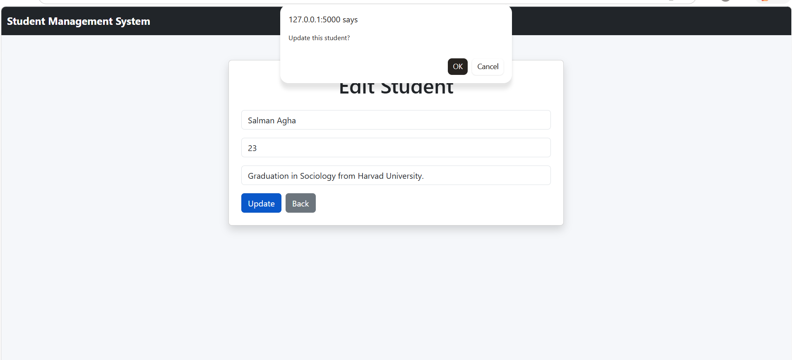
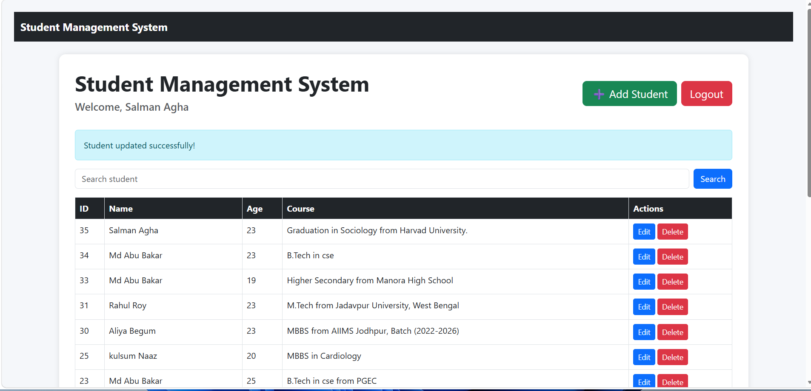
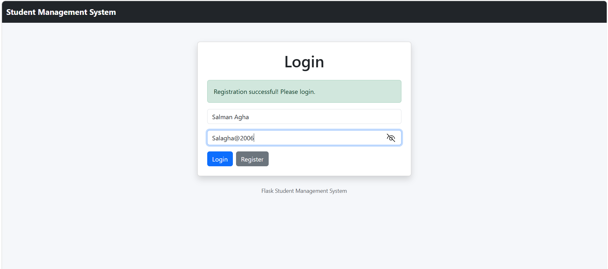

# Student Management System

A Flask-based web application for managing students.

## Features
## Features

- User Registration
- User Login Authentication
- Add New Students
- Edit Student Details
- Delete Students
- Search Students
- Flash Messages for Success/Error
- SQLite Database Integration
- Responsive UI using Bootstrap

---

## Project Screenshots

### Login Page


---

### Registration Page


---

### Dashboard


---

### Add Student


---

### Student Added Successfully



---

### Student Already Exists Warning



---

### Search Student



---

### Edit Student



---

### Student Updated Successfully



---

### Invalid Login



---

## Run Locally

```bash
git clone https://github.com/MdAbuBakar209/student-management-system-flask.git

cd student-management-system-flask

pip install -r requirements.txt

python app.py
```

Open browser:

```bash
http://127.0.0.1:5000
```
