# Student Management System

A Flask-based web application for managing students.

---

## Features

- User Registration
- User Login Authentication
- Add New Students
- Edit Student Details
- Delete Students
- Search Students
- Logout Functionality
- Flash Messages for Success/Error
- SQLite Database Integration
- Responsive UI using Bootstrap
- Confirmation Alerts for Delete, Update, and Logout

---

## Live Demo

🚀 Live Website:  
[Student Management System Live Demo](https://student-management-system-flask-lilw.onrender.com)

---

## Project Screenshots


## Dashboard


---

## Register Page
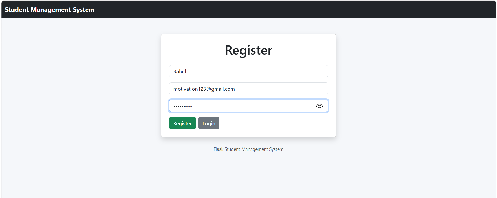

---

## Registration Successful
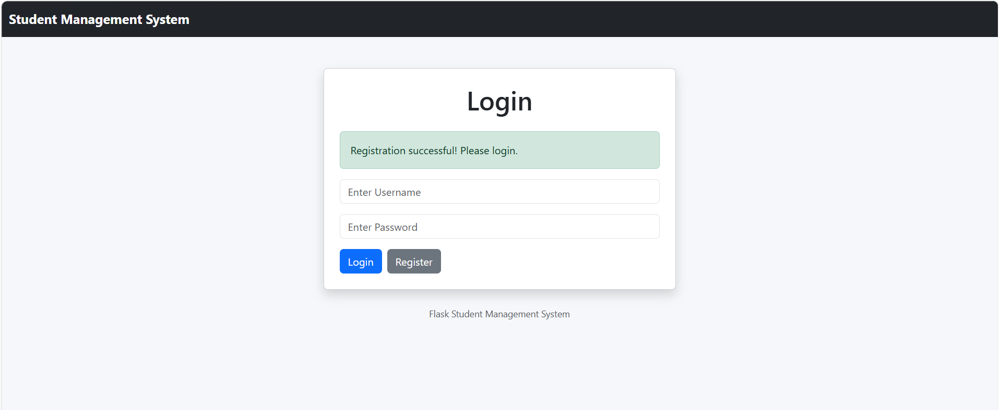

---

## Login Page
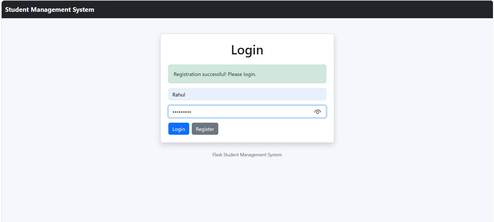

---

## Login Successful
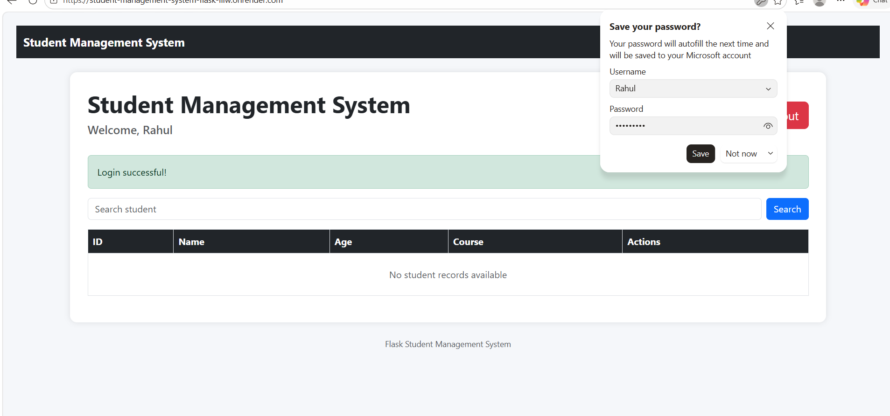

---

## Add Student
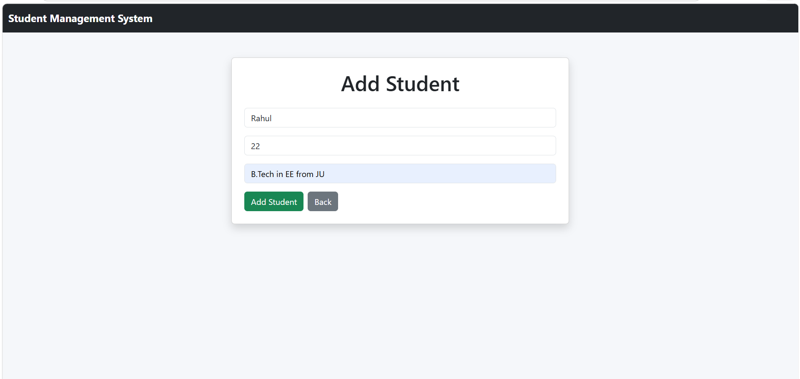

---

## Student Added Successfully
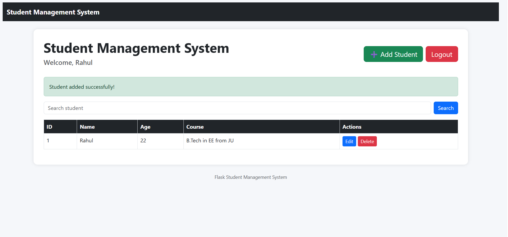

---

## Search Result Found
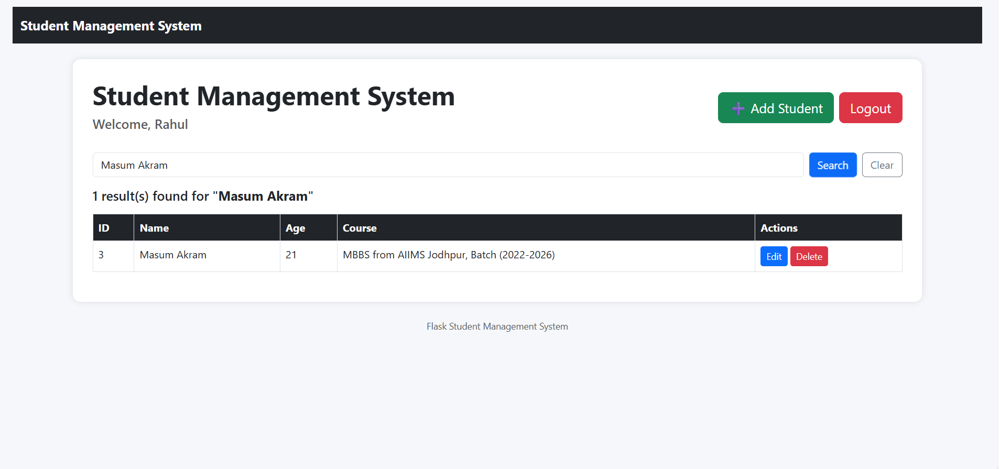

---

## No Student Found
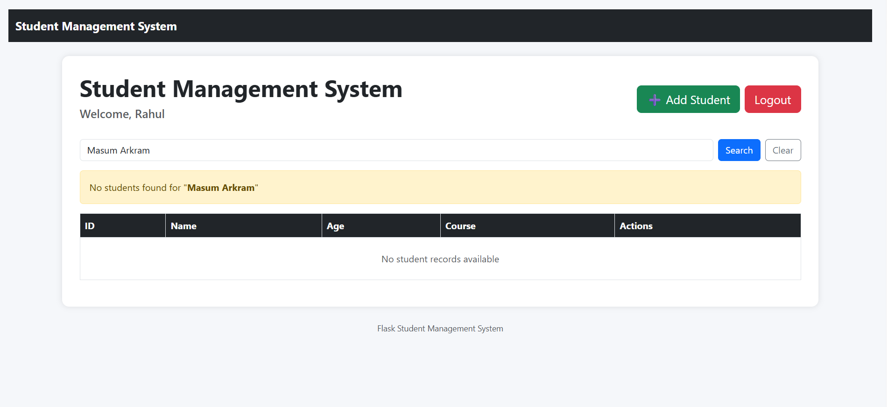

---

## Edit Student
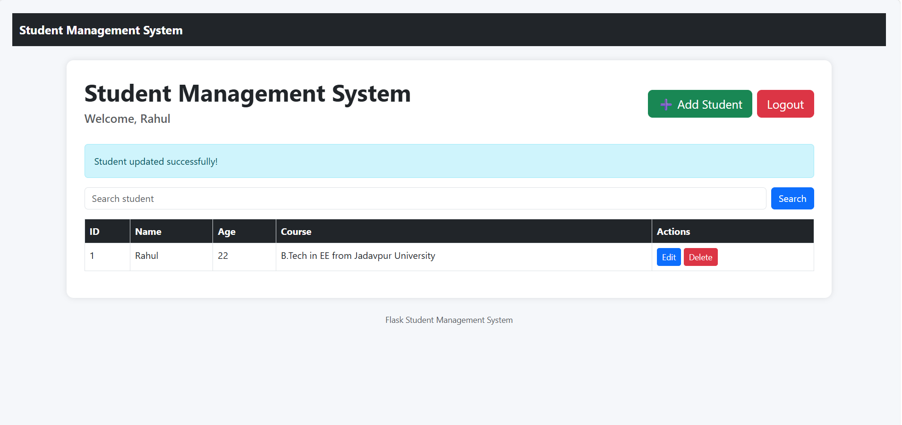
---

## Confirmation Before Update
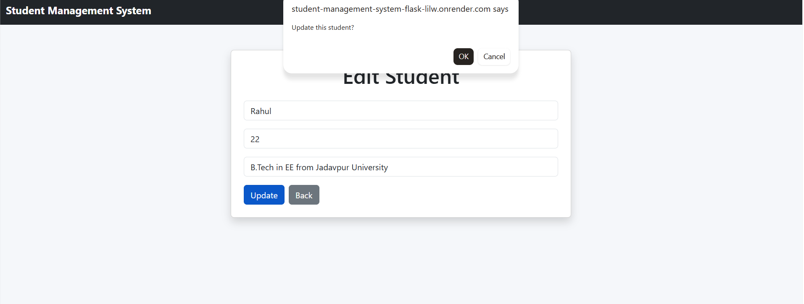

---


## Confirmation Before Delete
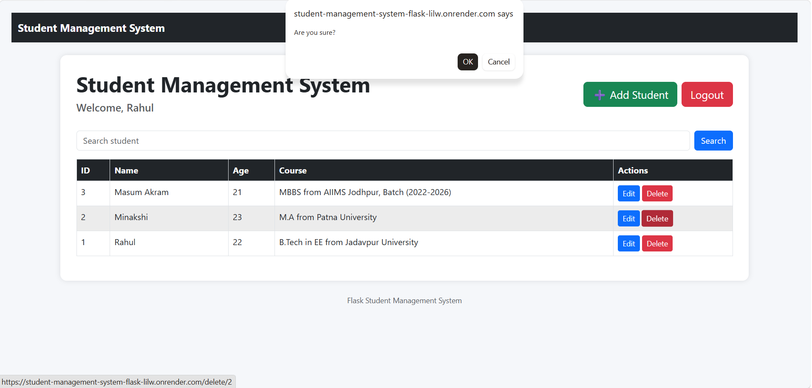

---

## Student Deleted Successfully
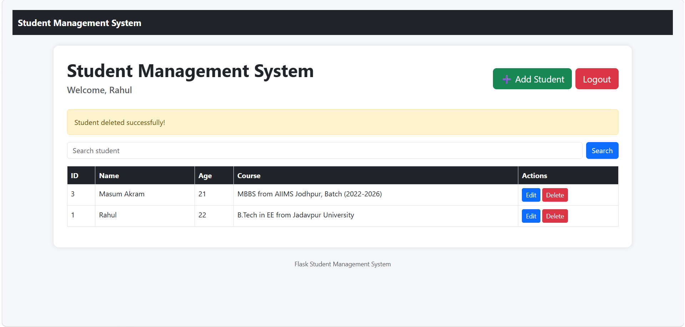

---

## Confirmation Before Logout
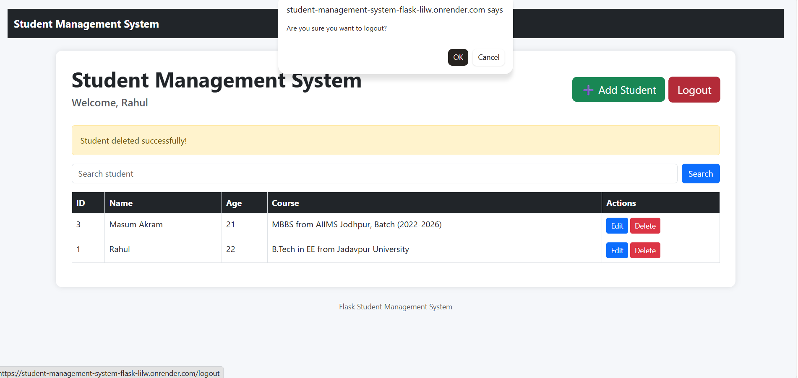

---

## Logout Successful
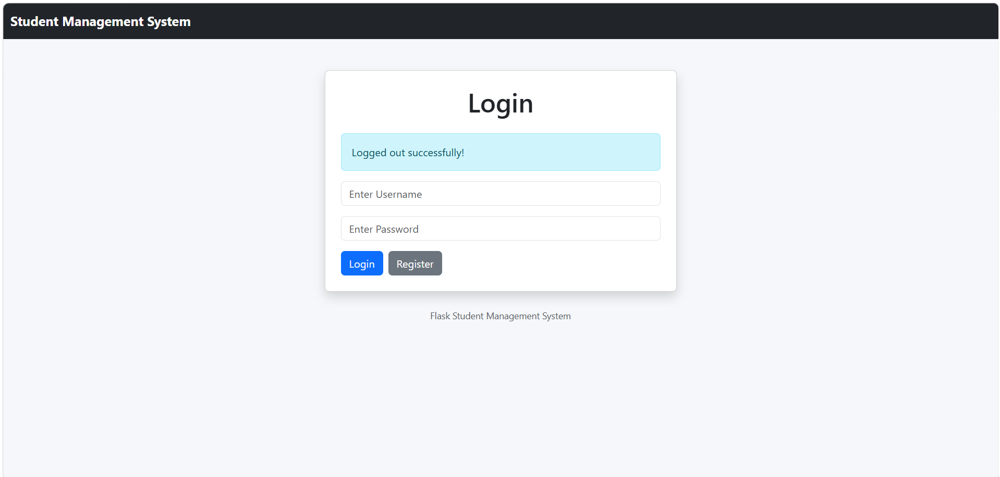

## Run Locally

```bash
git clone https://github.com/MdAbuBakar209/student-management-system-flask.git

cd student-management-system-flask

pip install -r requirements.txt

python app.py
```

Open browser:

```bash
http://127.0.0.1:5000
```